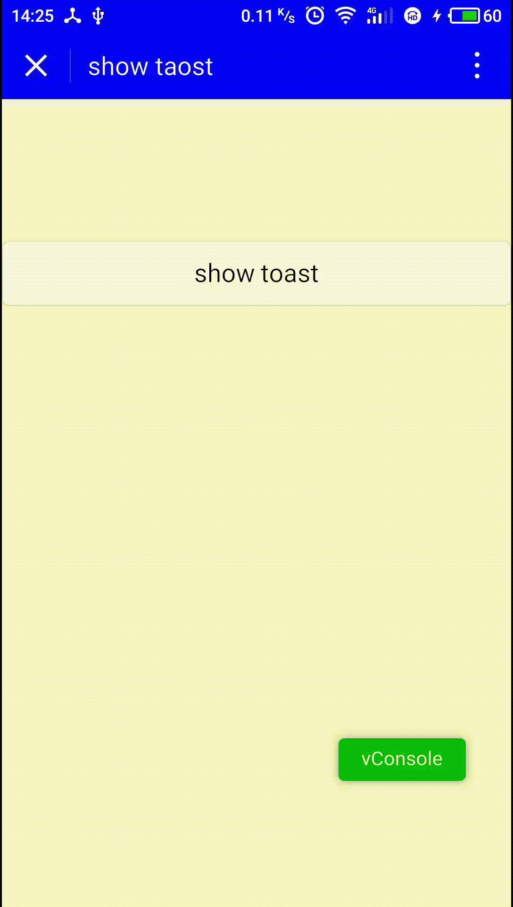

### 一个简单的微信小程序 Toast
--
因为微信提供的 toast 在显示的时候不能去掉图标, 而图标只提供了 `loading` `success` 在很多场景下不适用.

所以有了下面这个👇

--
####如何使用这个toast?

1. 建议将 `toast.wxml` 和 `toast.js` 分别拷贝到你的 `template` 和 `util` 文件夹.
2. 在需要使用这个 toast 功能的页面 wxml文件 顶部 include `toast.wxml`, 在使用的页面 js 文件中引入 `toast.js`
3. 调用 

		toast.showToast({
			context: this,
			title: 'this is toast content'
		})
	
	
#### doc:
<table>
<thead>
<tr>
<th>参数</th>
<th>类型</th>
<th>必填</th>
<th>说明</th>
</tr>
</thead>
<tbody>
<tr>
<td>context</td>
<td>object</td>
<td>是</td>
<td>调用这个 toast 的页面的 this 对象</td>
</tr>
<tr>
<td>title</td>
<td>String</td>
<td>是</td>
<td>提示的内容</td>
</tr>
<tr>
</tr>
<tr>
<td>duration</td>
<td>Number</td>
<td>否</td>
<td>提示的延迟时间，单位毫秒，默认：1500</td>
</tr>
</tbody>
</table>